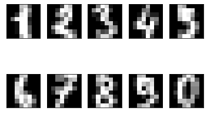
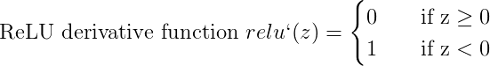
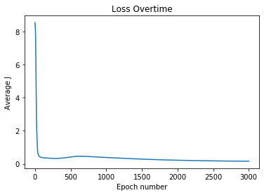
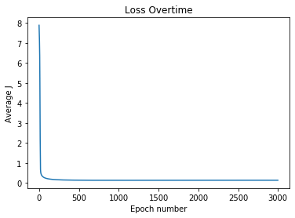
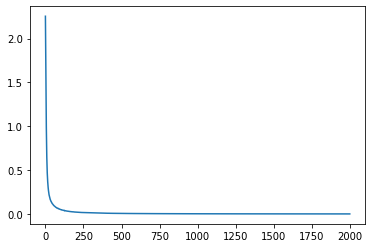

# Fully connected Neural Network with numpy

Implementation of a fully connected neural network from scratch in Python.

## Setup

```shell
$ python -m venv venv
$ pip install -r requirements.txt
```

To start a new Jupyter Notebook kernel based on the current virtualenv:

```shell
$ python -m ipykernel install --user --name ENV_NAME --display-name "ENV_DISPLAY_NAME"
```

To list all kernels:

```shell
$ jupyter kernelspec list
```

To remove a kernel:

```shell
$ jupyter kernelspec uninstall unwanted-kernel
```

### To set up Jupyter Notebook extensions

`pep8` package is required for auto-linting in the notebook.

```shell
$ pip install -e jupyter_contrib_nbextensions     # For pip
$ conda install -c conda-forge jupyter_contrib_nbextensions # For Anaconda
$ jupyter contrib nbextension install --user
$ pip install pep8                                # For pip, required for auto-linting
$ conda install -c anaconda pep8                  # For Anaconda, required for auto-linting
```

### To set up Jupyter Notebook themes

We use [dunovank/jupyter-themes](https://github.com/dunovank/jupyter-themes)

```shell
$ pip install --upgrade jupyterthemes             # For pip
$ conda install -c conda-forge jupyterthemes      # For Anaconda
$ jt -t chesterish -T -f roboto -fs 12 -cellw 95% # Sets theme to chesterish, enables toolbar, sets font to robot, sets fontsize to 12, set cell width to 95% of screen
```

### To set up a Jupyter Notebook instance in a Server

1.  `$ ssh username@server_ip_addr`
2.  Install anaconda in the server
3.  `$ conda create -n env_name python=3.7`
4.  `$ conda activate env_name`
5.  `$ conda install python_package_name`
6.  `$ conda info --env`
7.  `$ conda list`
8.  `$ ssh -L 8000:localhost:8888 username@your_server_ip` # From local machine terminal
9.  `$ jupyter notebook --no-browser`
10. On your local machine, go to `http://localhost:8000` and enter token from server.
11. `!conda list` # From inside the jupyter notebook test modules

### Conda environment package save and load

To export current conda env

`$ conda-env  export -n your_env_name > your_env_name.yml`

To create new environment using yml configuration file run:

`$ conda-env create -n new_env -f=\path\to\base.yml`

## Data

The data source used was the MNIST handwritten digit dataset.



## Preprocessing Data

The data present as `numpy.ndarray` must be standardized to zero mean and unit variance for faster training and to prevent problems with gradient vanishing or explosion.

## Activation functions used





## Results of training and testing with sklearn's train_test_split

**Note: All neural network models have a structure of [64, 30, 10] 64 input neurons, 30 hidden neurons and 10 output nerurons for digits from 0 to 9**

### Sigmoid Model



Accuracy = 95.54937%

### ReLU Model


Accuracy = 10.292072%

### Tanh Model



Accuracy = 97.079277%

We observe the highest accuracy for the [64, 30, 10] neurons model with the `tanh` activation function with prediction accuracy of `97.079277%` followed by the model with the `sigmoid` activation with accuracy of `95.54937%` and finally the model with the ReLU performed dreadfully, not learning the training set at all with an accuracy of a mere `10%`. ReLU might be performing poorly because ReLU activations should only be used for hidden layers and not all layers.

## Fully Connected Neural Network Implementation with PyTorch

With the Pytorch Implementation of the [64, 30, 10] structure, convergence is achieved very quickly with test set accuracy at 97.76%


